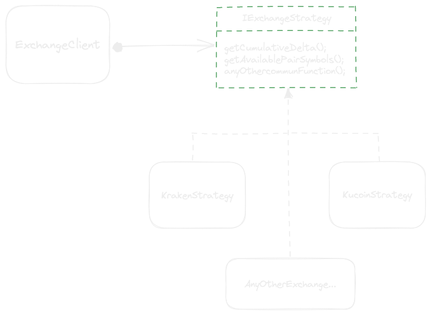
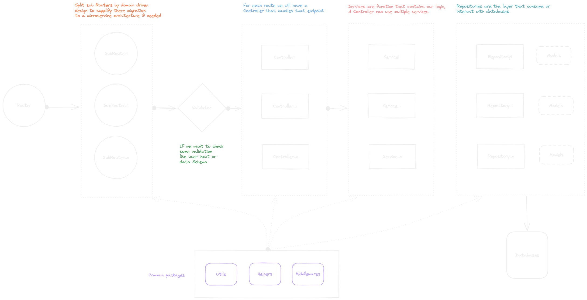

# Public_trades_cumulative_delta

(Read this readme in dark mode for better view)
This is a small project featuring a nodejs + typescript boilerplate architecture for a rest Api and a solution for calculating cumulative delta index for a specific trading pair of an included exchange.

## Subject

For a market maker, having an index that indicates its current cumulative delta on a specific
trading pair is essential. It’s used by risk management to evaluate there current position and if they need to take some actions.

To do that, we need to consume trades of in an exchange to calculate the cumulative delta.

In this repo, we are using the exchanges : [Kucoin](https://www.kucoin.com/fr) and [Kraken](https://www.kraken.com/);

To enable using multiple exchanges with the same base of code, we are using the **strategy design pattern**, we start by creating an `exchangeClient` that takes as en entry an `exchangeStrategy` then we use the same base methods to handle our cases, those method are overided in each strategy.

This diagram illustrate this pattern in our project :



To add any exchange, here are the main things to take into consideration by order:

-   Create your new exchangeStrategy in the file `src/helpers/ExchangeClient/exchangeStrategies/[name_of_your_strategy].ts`, it needs to implement the interface IExchangeStrategy.
-   Link your neawly created strategy to `exchangeStrategies` mapper.
-   Add all needed variable for your strategy in the `.env` file and the `KEYS.ts` file.
-   Enjoy your exchange strategy !

## Global Architecture

This diagram illustrate the global architecture of our Rest api.



## How To Use

To lunch the project, you can use on of those 2 solutions:

-   clone the repository, enter it and lunch this command:

```bash
yarn start:dev // for dev mode
yarn build & yarn start // to build then to lunch it in production mode
```

-   Use docker :

```bash
docker-compose up -d
```

To lunch unit tests, execute the command:

```bash
yarn test
```
